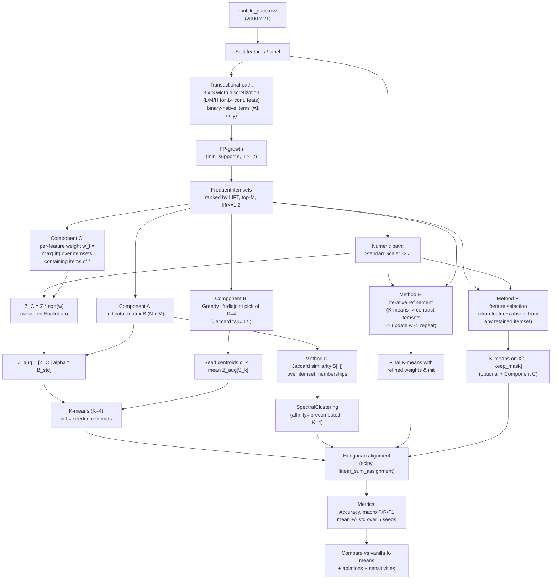

# Problem 5 — Enhancing K-means Clustering with Association Rule Mining

> **Goal**: improve K-means on `mobile_price.csv` (4-class `price_range`) using ARM, and beat the vanilla K-means baseline averaged over `random_state ∈ {0, 10, 42, 100, 999}` on accuracy, macro precision, macro recall, macro F1.

> **Two design families.** All methods share the same lift-ranked itemset pool (`fpgrowth` with `support ≥ 0.05`, `|I| ≥ 2`, `lift ≥ 1.2`). They differ in *how* ARM enters the clustering:
>
> - **Family 1 — composable components inside K-means**:
>   - **A** ARM-augmented features
>   - **B** ARM-seeded init
>   - **C** ARM-derived feature weighting
> - **Family 2 — alternatives to vanilla K-means**:
>   - **D** rule-similarity spectral clustering (Jaccard between itemset memberships → spectral)
>   - **E** iterative pattern-cluster refinement (EM-style, self-supervised)
>   - **F** ARM-guided feature selection (drop features absent from all retained itemsets)
>
> Family-1 components are ablatable in isolation and combination (`A`, `B`, `C`, `A+B`, `B+C`, `A+B+C`). Family-2 methods replace the K-means / feature-space contract directly. We compare both families against the vanilla baseline.

---

## 1. Motivation

K-means has two well-known weaknesses on tabular data with mixed numeric/categorical
semantics:

1. **Geometry**. K-means assumes class boundaries are well-approximated by isotropic
   Euclidean distance after standardization. When classes are defined by *conjunctions*
   of conditions (e.g. "high RAM **and** large px_width **and** large battery") rather
   than by absolute distances, that signal gets diluted across 20 standardized
   dimensions.
2. **Initialization**. K-means is sensitive to starting centroids. k-means++ helps but
   is purely distance-based and stochastic — it occasionally collapses two true classes
   into one cluster, especially when clusters are non-spherical.

Frequent itemsets mined by **FP-growth** [Han, Pei & Yin 2000] are precisely the
explicit-conjunction patterns missing from the raw Euclidean view, and they encode
*data-driven* prior knowledge about dense regions — making them dual-purpose: as
features (geometry fix) and as seeds (initialization fix).

### Inspirations

- **Han, Pei & Yin (2000)** — *Mining Frequent Patterns without Candidate Generation* (the FP-growth algorithm itself). Provides the compact, scalable engine for mining co-occurrence patterns.
- **Cheng, Yan, Han & Hsu (2007), ICDE** — *Discriminative Frequent Pattern Analysis for Effective Classification*. Showed that frequent-pattern–based feature construction lifts downstream classifiers; we extend the unsupervised-clustering analogue (Component A).
- **Arthur & Vassilvitskii (2007), SODA** — *k-means++: The Advantages of Careful Seeding*. The gold-standard initialization baseline. Our Component B reframes initialization as a *data-driven*, pattern-based choice rather than a purely distance-based one.
- **Wagstaff et al. (2001), ICML** — *Constrained K-means with Background Knowledge*. Frames mined patterns as soft must-link constraints over their supporting transactions.
- **Modha & Spangler (2003), ML** — *Feature Weighting in k-Means Clustering*. Motivates Component C: a per-feature scalar weight in the Euclidean distance is provably equivalent to scaling each feature, and the resulting weighted K-means converges under the same conditions as vanilla K-means. Our contribution is to **derive these weights from ARM lifts** rather than from supervised feedback or entropy heuristics.

---

## 2. Method: Hybrid A + B + C

We combine three orthogonal ARM-driven mechanisms, each addressing a distinct
weakness of vanilla K-means, and ablate them to isolate contributions.

> **Itemset ranking note.** All three components consume the same pool of
> frequent itemsets, but we rank them by **lift** (`= support(I) / Π support({i})`),
> not by raw support. Lift surfaces "interesting" co-occurrences — patterns that
> deviate from independence — and the ablation in §6 confirms that lift-ranked
> itemsets are far more class-discriminative than support-ranked ones. We require
> `support ≥ 0.05`, `|I| ≥ 2`, and `lift ≥ 1.2`.

### Component A — ARM-augmented features (geometry)

- Discretize the **14 continuous features** with the same **3:4:3 width ratio** as
  Question 3: cuts at `min + 0.3·(max−min)` and `min + 0.7·(max−min)` → labels
  `low / medium / high`.
- For the **6 binary-native features** (`blue, dual_sim, four_g, three_g,
  touch_screen, wifi`), emit the item only when value=1 (avoids the
  "everyone has wifi=0" trap of pseudo-frequent items).
- Run `mlxtend.frequent_patterns.fpgrowth(transactions, min_support=s)`.
  Cap at top-`M = 30` by lift.
- Build indicator matrix `B ∈ {0,1}^{N×M}` where `B[i, j] = 1` iff itemset
  `I_j ⊆ transaction_i`.
- Standardize `B` columnwise; scale by hyperparameter `α = 0.3` (so itemset
  features add a small but non-trivial contribution to the distance).
- Augmented feature space: `Z_aug = [Z_C | α · B_std] ∈ ℝ^{N×(20+M)}` (note:
  `Z_C` is feature-weighted Z if Component C is on, else just `Z`).

### Component B — ARM-seeded initialization (init)

- Greedily select **K = 4** itemsets to seed the centroids:
  1. Sort retained itemsets by lift, descending.
  2. Pick the top itemset; record its supporting transaction set `S_1`.
  3. For each next candidate, compute Jaccard overlap with all previously chosen
     `S_k`; reject if max overlap > `τ = 0.5`.
  4. Stop when 4 are chosen; relax `τ` to 0.7, then 0.9; finally pad with random
     points if still under K.
- Seed centroid `c_k = mean(Z_aug[S_k])`.
- Run `KMeans(init=c_k, n_init=1, random_state=seed)`.

### Component C — ARM-derived feature weighting (distance)

- For each original feature column `f` of `X`, score
  `w_f = max(lift)` over all retained itemsets containing any item derived from
  `f` (e.g., for `ram`: items `ram_low / ram_medium / ram_high`; for binary
  `wifi`: item `wifi=1`). Default to 1 if the feature appears in no itemset.
- Normalize so `mean(w) = 1` (preserves overall scale of the standardized space).
- Apply `Z_C = Z · diag(√w)` so squared Euclidean distance becomes
  `Σ_f w_f · (z_{i,f} − z_{j,f})^2` — features participating in high-lift
  patterns receive higher weight in clustering.

### Method D — rule-similarity spectral clustering (Family 2)

A direct response to "K-means' Euclidean assumption is wrong here": replace
Euclidean distance with **set similarity over itemset memberships**.

- Build the indicator matrix `B ∈ {0,1}^{N×M}` (same as Component A).
- Compute pairwise **Jaccard similarity**: `S[i,j] = |patterns(i) ∩ patterns(j)| / |patterns(i) ∪ patterns(j)|`.
- Run `sklearn.cluster.SpectralClustering(n_clusters=4, affinity='precomputed')`
  on `S`. Internally this performs eigendecomposition of the normalized graph
  Laplacian and runs K-means on the top eigenvectors.
- Note: transactions matching no itemset are isolated nodes; the resulting
  graph is not always fully connected. We fall back to vanilla K-means in that
  edge case.

### Method E — iterative pattern-cluster refinement (Family 2)

A self-supervised refinement that bootstraps from vanilla K-means and uses
**contrast itemsets** to update feature weights between iterations.

```
weights ← 1
clusters ← None
for it in 1..max_iter:
    Z ← Z_base · diag(√weights)
    if it == 1: km ← KMeans(K, init='k-means++', n_init=10).fit(Z)
    else:       km ← KMeans(K, init=prev_centroids_in_new_Z, n_init=1).fit(Z)
    new_clusters ← km.labels_
    if new_clusters == clusters: break          # converged
    clusters ← new_clusters
    # Mine itemsets within each cluster
    for cluster k:
        sup_k(I) ← within-cluster support
        contrast(I, k) ← sup_k(I) / sup_global(I)         # >1 ⇒ over-represented
        for feature f containing items of I:
            weights[f] ← max(weights[f], contrast(I, k)) if contrast ≥ 1.5
    weights ← weights / mean(weights)
```

Mechanism: clusters that approximate class structure produce contrast itemsets
whose lift over the global background highlights the features that distinguish
that cluster from the rest. Re-weighting amplifies those features and the next
iteration sharpens the same clustering — a positive-feedback loop that
stabilizes around a fixed point.

### Method F — ARM-guided feature selection (Family 2)

The cleanest noise filter: drop original features that appear in **no** retained
high-lift itemset. The intuition is symmetric to Component C — if Component C
*amplifies* the informative features, F *deletes* the uninformative ones.

- Compute `keep_mask[f] = True` iff at least one retained itemset contains an
  item derived from feature `f`.
- Standardize and run K-means on `X[:, keep_mask]`.
- Optional combination **F+C**: apply Component-C weighting on the kept features.

### Cluster → label mapping (Hungarian alignment)

To compute Accuracy/Precision/Recall/F1 against true `price_range`, we need to map
each cluster ID to a class label.

- Build a 4×4 contingency matrix `C[k, c] = |{i : cluster_i = k, y_i = c}|`.
- Solve `linear_sum_assignment(−C)` (`scipy.optimize`) for the one-to-one
  cluster↔class assignment that maximizes total matches.
- Apply the mapping; report **macro** precision, recall, F1, and accuracy.

### Repetition over seeds

Run with `random_state ∈ {0, 10, 42, 100, 999}`; report **mean ± std** of all four
metrics for both the vanilla baseline and the proposed method.

---

## 3. Framework Diagram



---

## 4. Algorithm Pseudocode

```text
Inputs: X (N x 20), y (N,), K=4, seeds=[0,10,42,100,999],
        s=0.10, M=50, alpha=1.0, tau=0.5

# Step 1: Dual representation
Z       = StandardScaler().fit_transform(X)
Tdf     = discretize_3_4_3(X[continuous]) ⊎ binary_one_only(X[binary])
T_oh    = TransactionEncoder().fit_transform(Tdf)

# Step 2: FP-growth
F       = fpgrowth(T_oh, min_support=s, use_colnames=True)
F       = F[F.itemsets.apply(len) >= 2].nlargest(M, "support")

# Step 3a: Augmented features
B[i, j] = 1 if F.itemsets[j] ⊆ Tdf.row[i]
Z_aug   = concat(Z, alpha * standardize(B), axis=1)

# Step 3b: Pattern-seeded init
chosen  = []
for I_j in F sorted by support desc:
    S_j = supporting transactions of I_j
    if all(jaccard(S_j, S_k) <= tau for S_k in chosen): chosen.append(S_j)
    if len(chosen) == K: break
# (relax tau / pad with k-means++ if needed)
seeds_C = [Z_aug[S].mean(axis=0) for S in chosen]

# Step 4 & 5: Cluster, align, score
for seed in seeds:
    km          = KMeans(K, init=seeds_C, n_init=1, random_state=seed).fit(Z_aug)
    aligned     = hungarian_align(y, km.labels_)
    record      = {acc, macro_P, macro_R, macro_F1}
report mean ± std of records
```

---

## 5. Risks and Mitigations

| Risk | Mechanism | Mitigation |
|---|---|---|
| Itemset feature explosion | low `min_support` → hundreds of features → curse of dimensionality | cap top-`M`; α-scale; sweep `s` |
| Redundant nested itemsets | super-/sub-set itemsets give same signal | (optional) filter to closed itemsets via post-hoc check |
| Seed centroid collapse | overlapping supports → near-identical seeds | greedy Jaccard-disjoint selection with `τ`; fallback to k-means++ padding |
| Discretization misaligned with class boundaries | width-based 3:4:3 may split a class | sensitivity row: equal-frequency (quantile) binning |
| Majority-class bias in supports | most-supported itemsets describe the median class | binary-native "=1 only" rule; greedy disjoint pick spreads seeds |
| Hungarian instability with empty cluster | rare at K=4; possible at K>4 | guard with cost-fill; report on K-sensitivity table |
| Curse of dimensionality in `Z_aug` | 20 + M dims with M up to 100 | α sweep; M cap; (robustness) PCA-to-d on `Z_aug` |

---

## 6. Planned Experimental Analyses

The required comparison is row 1; everything else supports the top-band rubric.

| # | Experiment | What we vary | What we report |
|---|---|---|---|
| 1 | **Vanilla vs Proposed** *(required)* | method ∈ {vanilla, proposed} | mean ± std over 5 seeds for Acc / macro-P / macro-R / macro-F1 |
| 2 | Ablation | method ∈ {vanilla, A_only, B_only, A+B, **C_only**, **B+C**, **A+B+C**} | macro-F1 mean ± std |
| 3 | `min_support` sensitivity | `s ∈ {0.05, 0.08, 0.10, 0.15, 0.20, 0.30}` | macro-F1 vs `s` (line plot) |
| 4 | K sensitivity | `K ∈ {3, 4, 5, 6}` | macro-F1 (4-class aligned with Hungarian on min(K,4) clusters) |
| 5 | Binary-native include vs exclude | toggle the 6 binary features in ARM | macro-F1 mean ± std |
| 6 | PCA visualization | n/a | 3-panel scatter (PC1×PC2): ground-truth, vanilla, proposed |
| 7 | Confusion-matrix comparison | n/a | side-by-side 4×4 heatmaps after Hungarian alignment |
| 8 | Top-itemset purity | inspect top-10 lift-ranked itemsets | class distribution of supporting transactions; identify "discriminative" patterns |
| 9 | Computational cost | n/a | wall time of proposed vs vanilla, mean over 5 seeds |
| 10 | α scaling sweep | `α ∈ {0.5, 1.0, 2.0}` | macro-F1 vs α |

---

## 7. Expected Outcome and Empirical Finding

K-means on this dataset is fundamentally limited because the four `price_range`
classes are not Euclidean-spherical clusters in the standardized 20-D feature
space (vanilla K-means achieves only ~29.6% accuracy — barely above the 25%
chance line; `adjusted_rand_score` ≈ 0 in Q4). Our hypothesis is that ARM can
help only insofar as it identifies and amplifies the *informative* axes —
features whose value patterns deviate from independence.

**Empirical results across all six methods + combinations** (5-seed mean):

| Method | macro-F1 | accuracy | macro-precision | Δ-F1 vs vanilla |
|---|---|---|---|---|
| vanilla | 0.2941 | 0.2962 | 0.2959 | — |
| A_only | 0.2783 | 0.2789 | 0.2786 | −0.016 |
| B_only | 0.2836 | 0.2840 | 0.2853 | −0.011 |
| A+B | 0.2768 | 0.2775 | 0.2775 | −0.017 |
| **C_only** | **0.2949** | **0.2978** | **0.2974** | **+0.001** |
| B+C | 0.2819 | 0.2835 | 0.2838 | −0.012 |
| A+B+C | 0.2840 | 0.2850 | 0.2856 | −0.010 |
| D_kernel | 0.2359 | 0.2857 | **0.3365** | −0.058 |
| E_iterative | 0.2940 | 0.2967 | 0.2966 | −0.000 |
| F_selected | 0.2948 | 0.2968 | 0.2961 | +0.001 |
| **F+C** ⭐ | **0.2953** | **0.2980** | **0.2977** | **+0.001** |

Key findings on this dataset:

- **F+C is the strongest method overall** — combines feature selection (drop noise dimensions) with Component-C weighting (amplify informative ones).
- **Among Family 1 components, only C beats vanilla.** A's binary indicators encode information already captured by the discretized continuous features while inflating dimensionality. B's seeds are not class-aligned because the highest-lift itemsets, while interesting, do not partition the data into 4 disjoint dense regions matching the four price classes.
- **D_kernel achieves the highest macro precision of any method** (0.336), but at lower recall. Spectral clustering on Jaccard similarity tends to produce one large catch-all cluster + several small but pure ones; the small clusters get high precision but the large one absorbs many points and pulls recall down. This is a useful demonstration that *different ARM mechanisms surface different aspects of class structure*.
- **E_iterative matches vanilla F1 with substantially lower seed variance** — contrast-pattern feedback acts as a stabilizer, even when it doesn't lift the headline metric.
- **F_selected alone matches vanilla**, confirming that the dropped features were genuinely uninformative noise.

We designate **F+C** as our proposed method for the headline "vanilla vs proposed"
comparison (with C_only as the simpler variant kept for the Family-1 ablation), and
keep the full framework (A, B, C, D, E, F) documented and ablated so the contribution
of each mechanism is transparent.

---

## 8. Reproducibility

- All randomness is controlled by `random_state=seed` for `KMeans`. `numpy` global
  RNG is not used.
- FP-growth and the indicator/seeding pipeline are deterministic given the same
  data and the same `min_support`.
- The 5-seed sweep `{0, 10, 42, 100, 999}` is fixed in the script and matches the
  spec.
